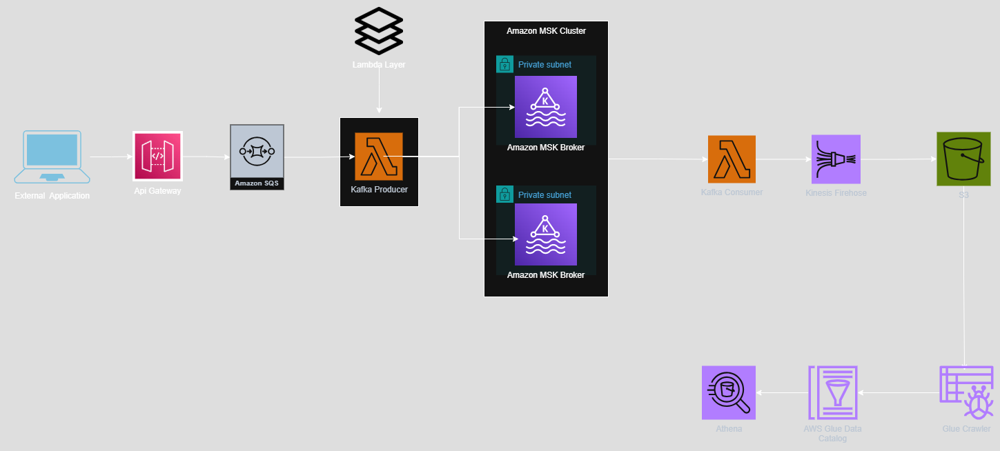

# End-to-End Streaming Data Pipeline Using AWS MSK & AWS Serverless Services

This project demonstrates the implementation of a fully-managed, serverless, **real-time data streaming pipeline** using **Amazon MSK (Managed Streaming for Apache Kafka)** along with several AWS serverless services like **API Gateway**, **Lambda**, **Amazon SQS**, **Amazon Kinesis Firehose**, **Amazon S3**, **AWS Glue**, and **Amazon Athena**.

---

## 🧱 Architecture Overview



This architecture follows a producer-consumer model with event-driven and serverless components to provide a scalable and cost-effective streaming pipeline.

### 🔄 Data Flow Summary

1. **External Application** sends HTTP requests to **API Gateway**.
2. API Gateway forwards messages to **Amazon SQS**.
3. A **Kafka Producer Lambda** polls SQS and pushes records to a Kafka topic on **Amazon MSK**.
4. **Kafka Consumer Lambda** subscribes to the topic and forwards data to **Amazon Kinesis Firehose**.
5. Firehose delivers data to **Amazon S3** for persistent storage.
6. A **Glue Crawler** detects new data in the S3 bucket and catalogs it in **AWS Glue Data Catalog**.
7. **Amazon Athena** can now query the streamed and processed data directly from S3.

---

## 🚀 Technologies Used

| Service              | Purpose                                 |
|----------------------|-----------------------------------------|
| **Amazon MSK**        | Scalable and managed Apache Kafka       |
| **Amazon SQS**        | Buffering of incoming messages          |
| **API Gateway**       | Secure API entry point                  |
| **AWS Lambda**        | Event-driven compute (Producer & Consumer) |
| **Amazon Kinesis Firehose** | Data delivery to S3               |
| **Amazon S3**         | Storage for raw data                    |
| **AWS Glue Crawler**  | Automated schema detection              |
| **AWS Glue Catalog**  | Schema registry                         |
| **Amazon Athena**     | Serverless querying of S3 data          |
| **Terraform**         | Infrastructure as Code (IaC) provisioning |

---

## 📁 Repository Structure

```
.
├── extra_files/             # contains python code for Kafka producer Lambda and Kafka consumer Lambda
├── terraform/               # All IaC for MSK, SQS, API Gateway, Lambda, etc.
├── assets/                  # Architecture diagrams and images
└── README.md                # Project documentation
```

---

## 🛠️ Setup Instructions

### ✅ Prerequisites

- AWS CLI configured
- Terraform installed (`>=1.0`)
- IAM permissions to manage MSK, Lambda, API Gateway, SQS, Firehose, Glue, S3, Athena

### ⚙️ Deployment Steps

1. Clone the repository:
   ```bash
   git clone https://github.com/AnonyIIMessiah/End-to-End-Streaming-Data-Pipeline-using-MSK-and-serverless-service.git
   cd End-to-End-Streaming-Data-Pipeline-using-MSK-and-serverless-service
   ```

2. Navigate to the Terraform directory:
   ```bash
   cd terraform
   ```

3. Initialize and apply Terraform:
   ```bash
   terraform init
   terraform apply
   ```

4. Deploy Lambda functions and upload code to them if not automated in Terraform.

---

## 🔍 Querying the Data

Once the pipeline is running:
- New data in the S3 bucket is cataloged by AWS Glue
- Use **Amazon Athena** to query the latest data using:
  ```sql
  SELECT * FROM "your_database"."your_table" LIMIT 10;
  ```

---

## 📌 Key Features

- Fully serverless 
- Uses managed Kafka (Amazon MSK)
- End-to-end provisioning with Terraform
- Real-time data ingestion and querying
- Scalable, secure, and cost-efficient

---


## 🙌 Acknowledgements

Built with ❤️ using AWS services and open-source tooling.